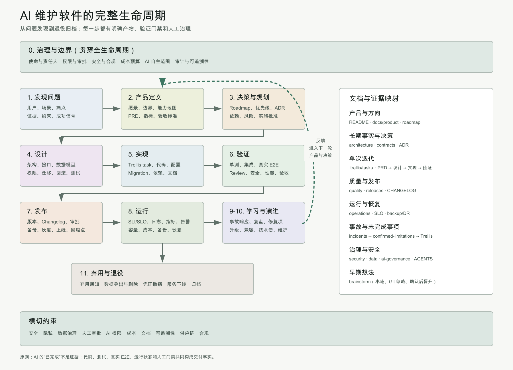

# AI 维护软件的完整生命周期

状态：生效中
最后更新：2026-08-02

本文描述当 AI 参与并维护软件整个生命周期时，项目需要覆盖的阶段、治理边界、文档产物和验证门禁。它是豆姐项目的全景检查框架，不代表每个分类都必须立即创建目录或模板。



可编辑源图：[SVG](../assets/ai-maintained-software-lifecycle.zh-CN.svg)。

## 生命周期主循环

```text
治理与边界（贯穿全程）
  |
  v
发现问题 -> 产品定义 -> 决策与规划
                         |
                         v
设计 -> 实现 -> 验证 -> 发布 -> 运行
                               |
                    +----------+----------+
                    v                     v
                 故障与学习            维护与演进
                    +----------+----------+
                               |
                               +-> 回到产品定义或新迭代
                               |
                               v
                         弃用与退役
```

安全、隐私、数据治理、可追溯性、人工审批、成本、文档和 AI 权限横跨全部阶段。

## 各阶段及必要产物

| 阶段 | 需要回答的问题 | 典型产物 |
|---|---|---|
| 治理与边界 | 谁负责、AI 能做什么、谁批准、风险和成本由谁承担 | 使命、AGENTS、权限模型、安全政策、审批门禁 |
| 发现问题 | 用户是谁、痛点是否真实、证据是什么 | 用户场景、问题陈述、事件证据、成功信号 |
| 产品定义 | 做什么、不做什么、如何判断成功 | Vision、能力地图、PRD、指标、验收标准 |
| 决策与规划 | 为什么现在做、依赖和替代方案是什么 | Roadmap、优先级、ADR、风险清单、实施批准 |
| 设计 | 系统如何变化，如何兼容、迁移和回滚 | 架构、接口契约、数据模型、权限和测试设计 |
| 实现 | 如何把已批准设计变成可审计变更 | Trellis task、代码、Migration、配置、依赖和文档 |
| 验证 | 如何证明行为正确且没有越权 | 单测、集成、真实 E2E、Review、安全和性能验证 |
| 发布 | 哪个版本上线，失败如何撤回 | Changelog、发布审批、备份、灰度、上线和回滚点 |
| 运行 | 系统是否健康，是否满足服务目标 | SLI/SLO、日志、指标、告警、容量、成本和恢复演练 |
| 故障与学习 | 发生了什么，如何防止复发 | Incident、复盘、Runbook 规则、修复 Backlog |
| 维护与演进 | 如何升级、兼容和偿还技术债 | 升级计划、兼容策略、依赖治理、重构任务 |
| 弃用与退役 | 如何安全停止能力和处理数据 | Deprecation、通知、导出/删除、凭证撤销和归档 |

## 豆姐当前覆盖情况

### 已建立

- 项目使命：`README.md`、`AGENTS.md`、ADR-0001；
- 架构与 Session 模型：`docs/architecture/`、ADR-0002；
- 单次需求、设计和验证：`.trellis/tasks/`；
- 开发规范：`.trellis/spec/`；
- 部署和运维：`docs/deployment/`、`docs/operations/`；
- 决策历史：`docs/decisions/`；
- 事故复盘：`docs/incidents/`；
- 安全边界：`docs/security/`；
- 未交付问题：`backlog/confirmed-limitations/`；
- 早期想法：本地 `brainstorm/`。

### 仍需逐步补齐

1. **产品管理**：Vision、能力地图、Roadmap 和成功指标；
2. **发布管理**：版本策略、`CHANGELOG.md`、兼容和正式发布流程；
3. **质量策略**：全项目测试分层、真实 E2E 矩阵、可靠性要求；
4. **可观测性**：SLI/SLO、告警、容量、成本和运行健康定义；
5. **威胁模型**：Prompt injection、完整权限 Agent、供应链和远程暴露；
6. **数据生命周期**：数据清单、保留、删除、备份和恢复；
7. **接口契约**：配置、飞书事件、registry、processing/durable run 状态机；
8. **弃用退役**：命令、配置、旧部署、凭证和数据的下线流程；
9. **AI 治理**：Agent 自主范围、模型/CLI 升级、独立 Review 和证据规则。

## AI 开发特有的治理规则

### 权限和人工门禁

- 明确 AI 可以自主执行、需要结构化确认、必须人工操作的动作；
- Commit、push、release、部署、重启和数据删除是不同权限；
- 完整权限 Agent 必须受身份、工作区、Session 和命令构造约束；
- AI 不能通过修改验收规则来证明自己的实现通过。

### 证据与可追溯性

- AI 的文字陈述不是完成证据；
- 单元测试通过不能冒充真实飞书 E2E；
- 每次迭代应能定位任务、Agent、Session、工作目录、代码提交和验证结果；
- Review 应尽可能独立，并核实高风险结论，避免 AI 自证循环；
- 验证记录不得包含真实凭证、身份标识或完整私人会话。

### 模型和工具治理

- 模型、Codex CLI、lark-cli、Skill 和 Trellis 升级都可能改变行为；
- 升级前记录版本和影响面，升级后执行对应回归；
- 不把“latest”永久写进稳定文档，实际版本应实时查询；
- Provider Session 的原始数据由 provider 管理，控制面只建立外部 registry 和审计关系。

## 推荐的目标结构

```text
docs/
├── README.md
├── documentation-lifecycle.md
├── product/
├── architecture/
├── contracts/
├── decisions/
├── quality/
├── security/
├── data/
├── ai-governance/
├── deployment/
├── releases/
├── operations/
└── incidents/

backlog/
└── confirmed-limitations/

.trellis/
├── spec/
├── tasks/
└── workspace/

brainstorm/              # Git ignored
CHANGELOG.md
AGENTS.md
README.md
```

## 渐进建设顺序

目录不是越多越好，不创建无人维护的空模板。豆姐下一批最有价值的内容建议按以下顺序形成：

1. `docs/product/vision-and-roadmap.md`；
2. `docs/quality/test-strategy.md`；
3. `docs/security/threat-model.md`；
4. `docs/data/data-lifecycle.md`；
5. `docs/contracts/session-and-run-state.md`；
6. `docs/operations/backup-and-disaster-recovery.md`；
7. `CHANGELOG.md` 和发布流程；
8. `docs/ai-governance/agent-authority.md`。

Durable Run 正式开始开发时，再由对应 Trellis task 定义详细状态机和迁移，不提前在稳定文档中猜测实现。

## 生命周期完成标准

一个能力只有同时满足以下条件，才应被视为完成：

1. 用户问题和产品边界明确；
2. 关键决策、权限和失败模式已记录；
3. 实现通过代码质量门禁；
4. 对应层级的自动化测试和真实 E2E 通过；
5. 部署、回滚和数据兼容路径存在；
6. 运行状态可观察，故障能够恢复；
7. 稳定文档、Backlog 和 Trellis task 状态一致；
8. 用户要求的人工验收和发布授权已经完成。
